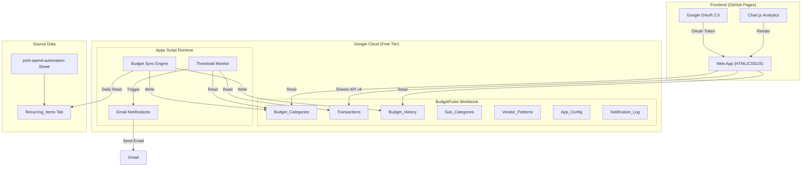
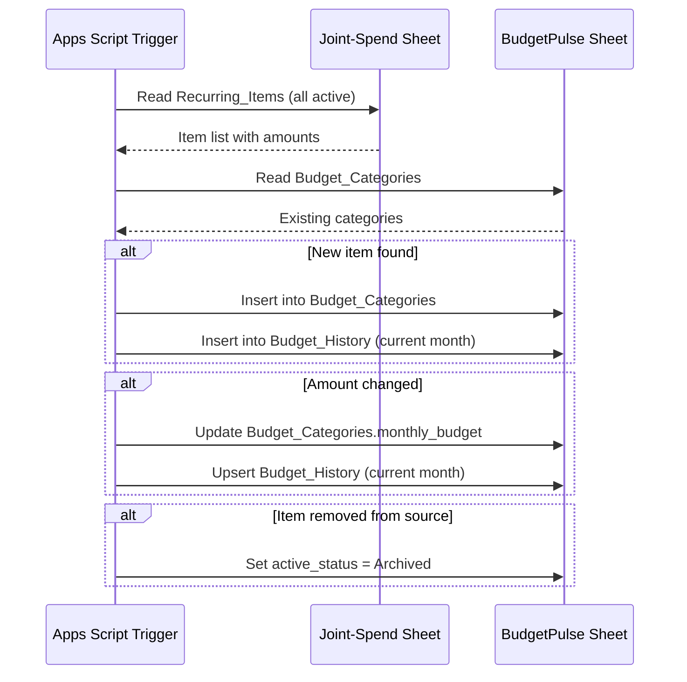
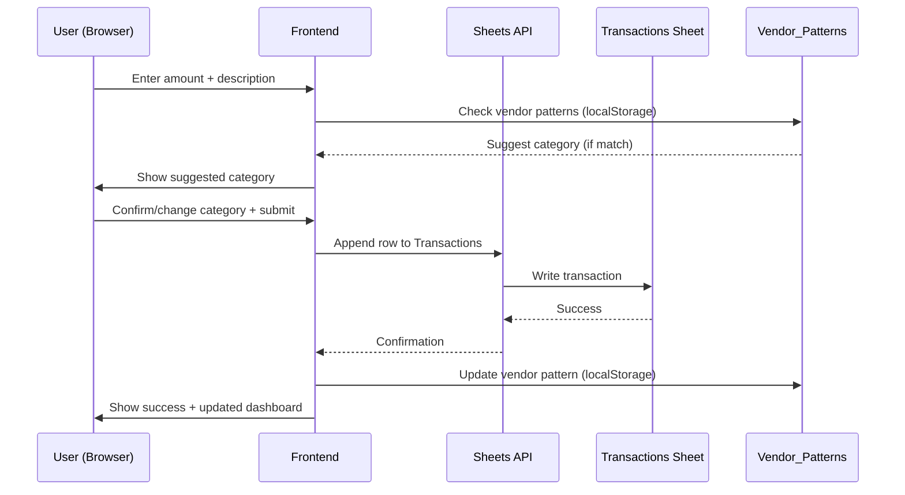
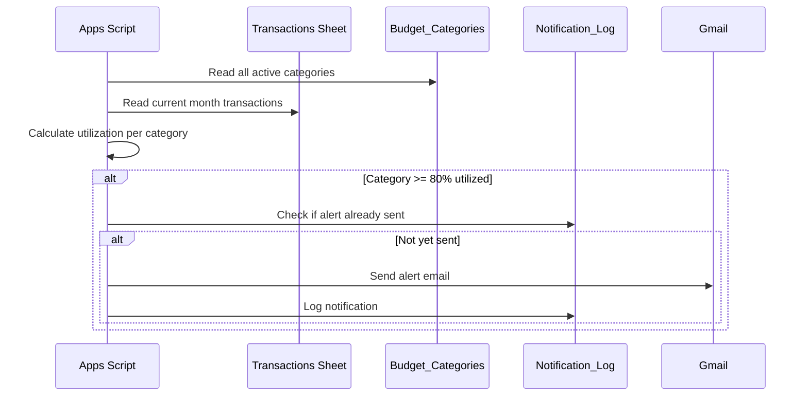
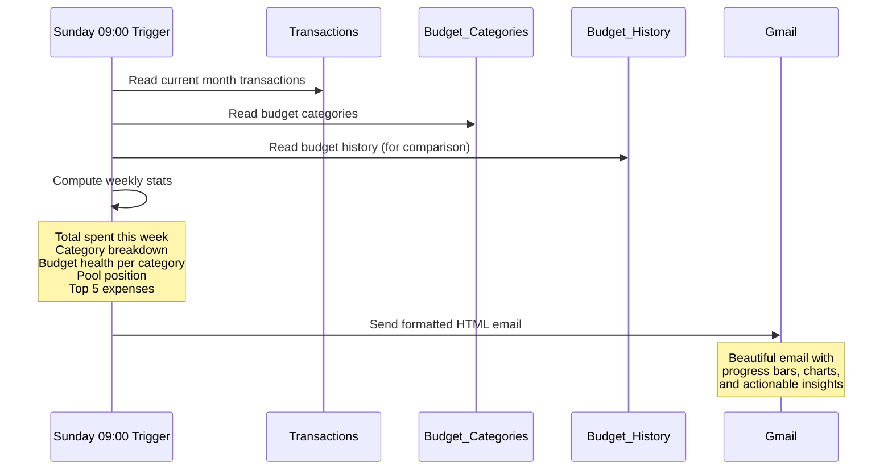
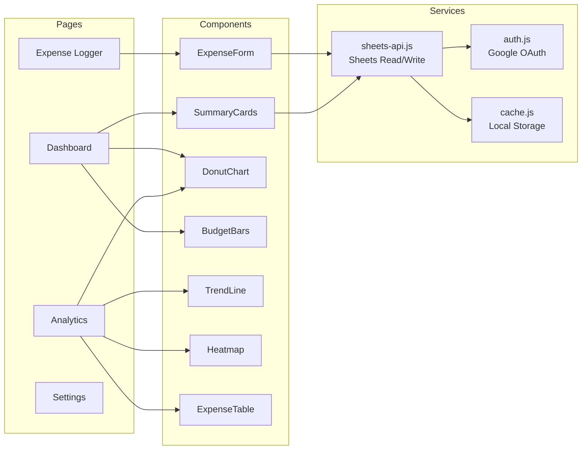
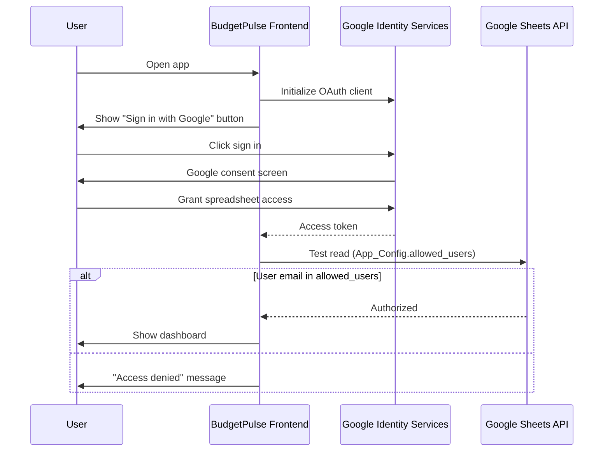

# System Architecture — BudgetPulse

---

## High-Level Architecture Diagram



---

## Data Flow Diagrams

### Flow 1: Budget Sync (Daily)



### Flow 2: Expense Logging



### Flow 3: Budget Alert



### Flow 4: Weekly Summary



---

## Component Architecture (Frontend)



---

## Authentication Flow



---

## Notification Architecture

```
Apps Script Triggers (Google's cron)
│
├── Daily 00:30 → Budget Sync Engine
│   └── Reads Recurring_Items → Updates Budget_Categories + Budget_History
│
├── Daily 20:00 → No-Log Reminder Check
│   └── Checks last transaction timestamp per user
│   └── If > 48 hours → Send reminder email
│
├── Every 6 hours → Budget Threshold Monitor
│   └── For each active category:
│       └── If spent/budget >= 80% AND alert not already sent → Email alert
│
├── Sunday 09:00 → Weekly Summary
│   └── Computes: weekly spend, category health, pool position, trends
│   └── Sends HTML email with inline charts
│
└── 1st of Month 09:00 → Monthly Report
    └── Computes: full month analytics, MoM comparison, personal payment summary
    └── Sends comprehensive HTML email
```

---

## Error Handling Strategy

| Error Type | Handling |
|-----------|----------|
| Sheets API rate limit (429) | Exponential backoff (3 retries) |
| Auth token expired | Auto-refresh via GIS |
| Sheet not found | Graceful error message + suggest running setup |
| Network offline | Queue writes in localStorage, sync on reconnect |
| Sync conflict (joint-spend sheet changed structure) | Log error, continue with cached categories |
## Current Frontend Shell

The current local frontend slice is a static shell with three layers:

1. `index.html` as the hosting entry point for GitHub Pages.
2. `src/js/main.js` as the bootstrapping layer.
3. `src/js/app-shell.js` as the initial UI contract for auth, overview, logging, and health placeholders.

This shell does not yet perform OAuth or Sheets reads. Those integrations remain the responsibility of `B-005` and `B-006`.
