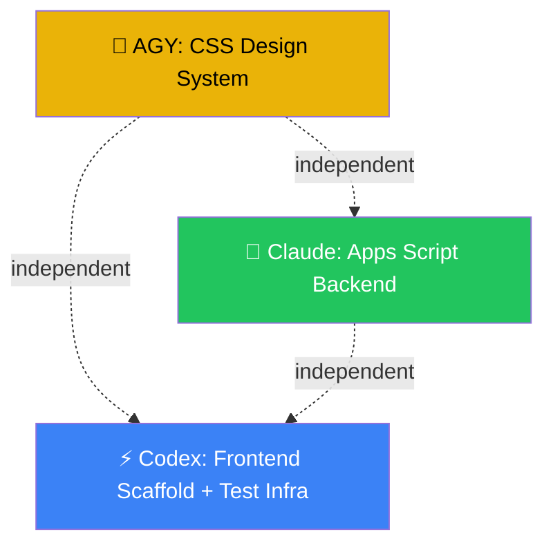

# BudgetPulse — Parallel Agent Task Breakdown

> Current state: All docs complete, `src/` and `scripts/` empty. Sprint 1 scope (B-001 through B-004b).

---

## Available Agents

| Agent | Best For | Avoid |
|-------|----------|-------|
| **🚀 AGY** (Antigravity) | Design systems, UI polish, aesthetics, subagent orchestration, image gen | Pure backend logic |
| **🧠 Claude** | Complex business logic, reasoning-heavy code, TDD, architecture | Boilerplate/config churn |
| **⚡ Codex** | Fast scaffolding, boilerplate, config files, utility code | Design-heavy UI work |

---

## Dependency Graph



---

## Phase 1: Foundation (Sprint 1) — All 3 Agents in Parallel

### 🚀 AGY → CSS Design System
**Files:** `src/css/variables.css`, `src/css/base.css`, `src/css/components.css`, `src/css/responsive.css`
**Why AGY:** Built-in web design guidelines, design tokens expertise, aesthetic-first approach
**Deps:** None
**Backlog:** B-004 (partial)

| # | Task | Output File |
|---|------|-------------|
| 1 | ✅ Design tokens: colors, spacing, typography (Inter font), radii, shadows | `variables.css` |
| 2 | ✅ CSS reset, body/html base styles, utility classes | `base.css` |
| 3 | ✅ Component styles: cards, buttons, forms, health bars, nav, modals, toasts | `components.css` |
| 4 | ✅ Mobile breakpoints, responsive grid, touch targets | `responsive.css` |

---

### 🧠 Claude → Apps Script Backend ✅ DONE (2026-06-21)
**Files:** `scripts/apps-script/Config.gs`, `Sync.gs`, `Helpers.gs`, `Notifications.gs`, `Alerts.gs`
**Why Claude:** Complex sync logic (diffing categories, handling archives, mid-month changes), reasoning-heavy business rules
**Deps:** None — completely independent from frontend
**Backlog:** B-002, B-003

| # | Task | Output File | Status |
|---|------|-------------|--------|
| 1 | `Config.gs` — Sheet names, column indices, config reader from `App_Config` tab | `Config.gs` | ✅ |
| 2 | `Helpers.gs` — Logging, date utils, ID generation, sheet-lookup helpers | `Helpers.gs` | ✅ |
| 3 | `Sync.gs` — Budget sync engine: read `Recurring_Items` from joint-spend, upsert `Budget_Categories`, write `Budget_History`, handle archive/new/changed | `Sync.gs` | ✅ |
| 4 | `Notifications.gs` — Weekly summary email, monthly report email templates, no-log reminder | `Notifications.gs` | ✅ |
| 5 | `Alerts.gs` — Budget threshold monitor (80% check), dedup via `Notification_Log` | `Alerts.gs` | ✅ |

---

### ⚡ Codex → Frontend Scaffold + Test Infrastructure
**Files:** `src/index.html`, `src/js/app.js`, `src/js/utils.js`, `package.json`, test configs + scaffolds
**Why Codex:** Fast at boilerplate, config files, project setup — both tasks are scaffolding-heavy
**Deps:** None (references CSS classes from AGY but can stub)
**Backlog:** B-004, B-004a, B-004b

| # | Task | Output File |
|---|------|-------------|
| 1 | `index.html` — SPA shell with all page sections (login, dashboard, expense-log, analytics, settings), nav, meta tags, CDN links (Chart.js, Lucide, Inter font) | `index.html` |
| 2 | `app.js` — Router/page-switcher, init, event wiring | `app.js` |
| 3 | `utils.js` — Currency formatter (INR), date helpers, DOM helpers, ID generator | `utils.js` |
| 4 | `package.json` — devDependencies (vitest, @testing-library/dom, playwright), npm scripts | `package.json` |
| 5 | Vitest config + sample unit test for `utils.js` | `vitest.config.js`, `tests/unit/utils.test.js` |
| 6 | Playwright config + sample E2E test | `playwright.config.js`, `tests/e2e/app.spec.js` |
| 7 | Apps Script mock classes + sample sync test | `tests/apps-script/mocks.js`, `tests/apps-script/sync.test.js` |

**Status Update (2026-06-21):** Phase 1 Codex deliverables are complete.

- [x] `index.html` SPA shell completed
- [x] `app.js` router/init wiring completed
- [x] `utils.js` formatter/helper module completed
- [x] `package.json` dev dependency and scripts setup completed
- [x] `vitest.config.js` and `tests/unit/utils.test.js` completed
- [x] `playwright.config.js` and `tests/e2e/app.spec.js` completed
- [x] `tests/apps-script/mocks.js` and `tests/apps-script/sync.test.js` completed
- [x] Verified locally with `npm run test` and `npm run build`
- [ ] Not part of this pass: Phase 2 auth/API implementation (`B-005`, `B-006`)

---

## Phase 2: Auth + API (Sprint 2) — All 3 Agents in Parallel

### 🚀 AGY → Google OAuth Module
**Files:** `src/js/auth.js`
**Why AGY:** Login screen UI, user avatar display, sign-in/out buttons — design-sensitive
**Deps:** `app.js` (Phase 1)
**Backlog:** B-005

| # | Task |
|---|------|
| 1 | ✅ Google Identity Services integration — init, sign-in, sign-out |
| 2 | ✅ Token management — store, refresh, expiry handling |
| 3 | ✅ Authorization check — read `allowed_users` from `App_Config`, gate access |
| 4 | ✅ UI state — show/hide login screen, user avatar, sign-out button |

**Status Update (2026-06-21):** AGY has completed `src/js/auth.js` and `tests/unit/auth.test.js`. 
*Note for Codex:* Please add `import { initAuth } from './src/js/auth.js'` to `app.js` and initialize it so the Auth flow and E2E tests are activated.

### 🧠 Claude → Sheets API Wrapper + Cache Layer
**Files:** `src/js/sheets-api.js`, `src/js/cache.js`
**Why Claude:** Retry logic, exponential backoff, offline queue, error taxonomy — reasoning-heavy
**Deps:** `auth.js` interface (code against contract)
**Backlog:** B-006

| # | Task |
|---|------|
| 1 | `sheets-api.js` — CRUD wrapper: readRange, appendRow, updateRow, batchGet |
| 2 | Error handling — 429 backoff, token refresh, offline detection |
| 3 | `cache.js` — sessionStorage for categories, localStorage for vendor patterns, memory cache for transactions |
| 4 | Offline write queue — queue writes in localStorage, flush on reconnect |

### ⚡ Codex → Categories Module
**Files:** `src/js/categories.js`
**Why Codex:** Straightforward data fetching + dropdown rendering, no complex logic
**Deps:** `sheets-api.js` interface
**Backlog:** B-008

| # | Task |
|---|------|
| 1 | Fetch + cache `Budget_Categories` |
| 2 | Fetch + cache `Sub_Categories` |
| 3 | Render category dropdown component |
| 4 | Support on-the-fly sub-category creation |

---

## Phase 3: Core Features (Sprint 3-4) — All 3 Agents in Parallel

### 🚀 AGY → Dashboard
**Files:** `src/js/dashboard.js`
**Why AGY:** Design-heavy — summary cards, health bars with color coding, pool indicator, loading/empty states need visual polish
**Deps:** `sheets-api.js`, `categories.js`
**Backlog:** B-010, B-011, B-012

| # | Task |
|---|------|
| 1 | Summary cards — total budget, spent, remaining, savings rate |
| 2 | Per-category budget health bars (green/amber/red/critical) |
| 3 | Pool health indicator — net surplus/shortfall |
| 4 | Loading states + empty states |

### 🧠 Claude → Expense Logger
**Files:** `src/js/expense-logger.js`
**Why Claude:** Core business logic — vendor pattern matching, optimistic UI rollback, form validation, <10s logging constraint
**Deps:** `sheets-api.js`, `categories.js`
**Backlog:** B-007, B-009

| # | Task |
|---|------|
| 1 | Quick-add expense form — amount, category, sub-category, description, paid_by, funding_source |
| 2 | Form validation + submission to Sheets API |
| 3 | Optimistic UI updates + rollback on failure |
| 4 | Recent transactions list (current month) |
| 5 | Vendor pattern matching (read/update `Vendor_Patterns` via localStorage) |

### ⚡ Codex → Analytics Charts
**Files:** `src/js/analytics.js`
**Why Codex:** Chart.js config is structured/declarative, data transformation is mechanical
**Deps:** `sheets-api.js`, Chart.js (CDN)
**Backlog:** B-013, B-014, B-015

| # | Task |
|---|------|
| 1 | Category donut chart (Chart.js) |
| 2 | Budget vs Actual bar chart |
| 3 | Monthly trend line (6 months) |
| 4 | Top 5 expenses table |

---

## Assignment Summary

| Phase | 🚀 AGY | 🧠 Claude | ⚡ Codex |
|-------|---------|-----------|----------|
| **Phase 1** (S1) | CSS Design System ✅ DONE | Apps Script Backend ✅ DONE | Frontend Scaffold + Test Infra |
| **Phase 2** (S2) | OAuth Module ✅ DONE | Sheets API + Cache | Categories Module |
| **Phase 3** (S3-4) | Dashboard | Expense Logger | Analytics Charts |

---

## File Ownership (No Conflicts)

| Agent | Owned Files |
|-------|-------------|
| 🚀 AGY | `src/css/*`, `src/js/auth.js`, `src/js/dashboard.js` |
| 🧠 Claude | `scripts/apps-script/*`, `src/js/sheets-api.js`, `src/js/cache.js`, `src/js/expense-logger.js` |
| ⚡ Codex | `index.html`, `app.js`, `utils.js`, `src/js/categories.js`, `src/js/analytics.js`, `package.json`, `tests/*`, `*.config.js` |

> **Zero overlap** — no two agents ever write the same file. Prevents merge conflicts entirely.

---

## Execution Playbook

```
PHASE 1 — kick off all 3 simultaneously
  ├── 🚀 AGY:   "Build CSS design system for BudgetPulse. Read docs/architecture/tech-stack.md for specs."
  ├── 🧠 Claude: "Build Apps Script backend. Read docs/architecture/data-model.md and system-architecture.md."
  └── ⚡ Codex:  "Scaffold frontend + test infra. Read docs/architecture/tech-stack.md for folder structure."
  
  WAIT → all 3 done → commit + merge

PHASE 2 — kick off all 3 simultaneously
  ├── ✅ 🚀 AGY:   "Build Google OAuth module in src/js/auth.js." (DONE)
  ├── 🧠 Claude: "Build Sheets API wrapper + cache layer."
  └── ⚡ Codex:  "Build categories module in src/js/categories.js."
  
  WAIT → all 3 done → commit + merge

PHASE 3 — kick off all 3 simultaneously
  ├── 🚀 AGY:   "Build dashboard with summary cards, health bars, pool indicator."
  ├── 🧠 Claude: "Build expense logger with vendor patterns and optimistic UI."
  └── ⚡ Codex:  "Build analytics charts with Chart.js (donut, bar, trend line)."
  
  WAIT → all 3 done → commit + merge → MVP READY
```
